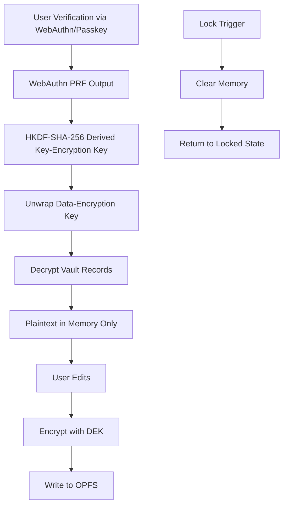
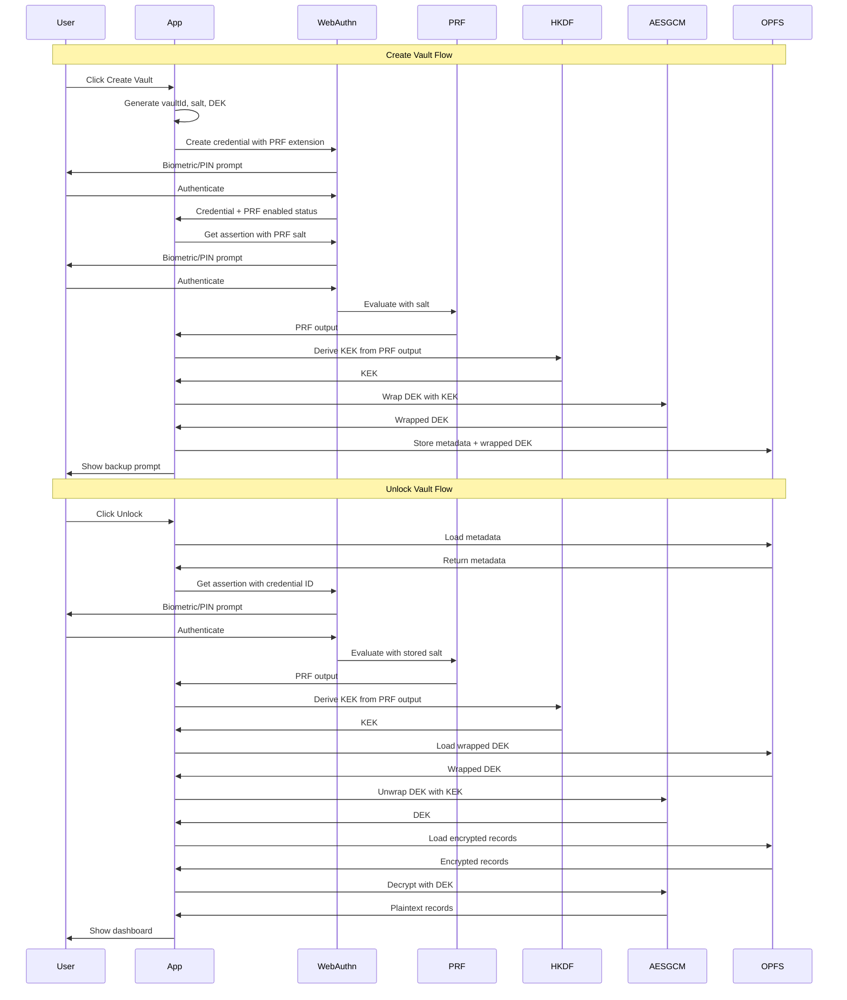

# Local Wallet Vault - Implementation Plan

## Project Overview

**Local Wallet Vault** is a frontend-only Progressive Web App (PWA) that stores encrypted wallet-related data locally in the browser using:

- **WebAuthn PRF** for user verification-gated key derivation
- **OPFS** (Origin Private File System) for encrypted data storage
- **AES-GCM-256** for authenticated encryption
- **HKDF-SHA-256** for key derivation

### Core Architecture Flow



---

## Technology Stack

| Area | Technology |
|------|------------|
| UI Framework | React 19.x |
| Build Tool | Vite 8.x |
| Bundler | Rolldown (via Vite 8) |
| Language | TypeScript 6.0 |
| UI Kit | shadcn/ui v4 |
| PWA Plugin | vite-plugin-pwa 1.x |
| Package Manager | pnpm |
| Crypto | WebCrypto API |
| Auth | WebAuthn with PRF extension |
| Storage | OPFS |

---

## Project Directory Structure

```
local-wallet-vault-pwa/
├── public/
│   ├── favicon.ico
│   ├── apple-touch-icon.png
│   └── icons/
│       ├── icon-192x192.png
│       └── icon-512x512.png
├── src/
│   ├── app/
│   │   ├── App.tsx
│   │   ├── routes.tsx
│   │   └── router.ts
│   ├── components/
│   │   ├── ui/                    # shadcn-generated components
│   │   │   ├── button.tsx
│   │   │   ├── card.tsx
│   │   │   ├── dialog.tsx
│   │   │   ├── alert.tsx
│   │   │   ├── badge.tsx
│   │   │   ├── tabs.tsx
│   │   │   ├── input.tsx
│   │   │   ├── label.tsx
│   │   │   ├── separator.tsx
│   │   │   ├── sonner.tsx
│   │   │   ├── switch.tsx
│   │   │   ├── tooltip.tsx
│   │   │   └── progress.tsx
│   │   ├── layout/
│   │   │   ├── Header.tsx
│   │   │   ├── Footer.tsx
│   │   │   └── MainLayout.tsx
│   │   └── security/
│   │       ├── SecurityWarning.tsx
│   │       └── ThreatModelPage.tsx
│   ├── features/
│   │   ├── onboarding/
│   │   │   ├── OnboardingPage.tsx
│   │   │   ├── WelcomeCard.tsx
│   │   │   └── LocalOnlyWarning.tsx
│   │   ├── capability-check/
│   │   │   ├── CapabilityCheckPage.tsx
│   │   │   ├── CapabilityList.tsx
│   │   │   └── CapabilityStatus.tsx
│   │   ├── vault/
│   │   │   ├── VaultCreatePage.tsx
│   │   │   ├── VaultUnlockPage.tsx
│   │   │   ├── VaultLockedPage.tsx
│   │   │   ├── VaultDashboard.tsx
│   │   │   ├── VaultDeleteDialog.tsx
│   │   │   └── VaultContext.tsx
│   │   ├── wallet-records/
│   │   │   ├── WalletRecordList.tsx
│   │   │   ├── WalletRecordCard.tsx
│   │   │   ├── WalletRecordForm.tsx
│   │   │   ├── WalletRecordDialog.tsx
│   │   │   └── WalletRecordSearch.tsx
│   │   └── backup/
│   │       ├── BackupExportDialog.tsx
│   │       ├── BackupImportDialog.tsx
│   │       └── BackupKeyDisplay.tsx
│   ├── lib/
│   │   ├── base64url.ts
│   │   ├── crypto/
│   │   │   ├── index.ts
│   │   │   ├── aesGcm.ts
│   │   │   ├── hkdf.ts
│   │   │   ├── envelopes.ts
│   │   │   └── keyWrap.ts
│   │   ├── webauthn/
│   │   │   ├── index.ts
│   │   │   ├── prf.ts
│   │   │   ├── credential.ts
│   │   │   └── capability.ts
│   │   ├── opfs/
│   │   │   ├── index.ts
│   │   │   ├── opfsRoot.ts
│   │   │   └── vaultStore.ts
│   │   ├── security/
│   │   │   ├── lockTimer.ts
│   │   │   └── redaction.ts
│   │   └── types/
│   │       ├── vault.ts
│   │       ├── wallet.ts
│   │       ├── envelope.ts
│   │       └── backup.ts
│   ├── workers/
│   │   └── vault.worker.ts
│   ├── hooks/
│   │   ├── useVault.ts
│   │   ├── useWebAuthn.ts
│   │   ├── useOPFS.ts
│   │   └── useLockTimer.ts
│   ├── pages/
│   │   ├── HomePage.tsx
│   │   ├── CreateVaultPage.tsx
│   │   ├── UnlockPage.tsx
│   │   ├── DashboardPage.tsx
│   │   └── ThreatModelPage.tsx
│   ├── main.tsx
│   └── vite-env.d.ts
├── tests/
│   ├── crypto/
│   │   ├── aesGcm.test.ts
│   │   ├── hkdf.test.ts
│   │   ├── envelopes.test.ts
│   │   └── keyWrap.test.ts
│   ├── webauthn/
│   │   ├── prf.test.ts
│   │   └── capability.test.ts
│   ├── opfs/
│   │   └── vaultStore.test.ts
│   └── integration/
│       ├── vault-create.test.ts
│       ├── vault-unlock.test.ts
│       └── backup-flow.test.ts
├── plans/
│   └── local-wallet-vault-implementation-plan.md
├── index.html
├── package.json
├── pnpm-lock.yaml
├── tsconfig.json
├── tsconfig.node.json
├── vite.config.ts
├── tailwind.config.js
├── postcss.config.js
├── components.json              # shadcn configuration
├── public/
│   └── manifest.json            # PWA manifest
├── README.md
└── SECURITY.md
```

---

## Implementation Milestones

### Milestone 1: Project Skeleton

**Goal:** Set up the foundational project structure with Vite, React, TypeScript, and shadcn/ui.

**Tasks:**
1. Initialize Vite React TypeScript project
2. Configure TypeScript with strict mode
3. Set up Tailwind CSS
4. Initialize shadcn/ui with required components
5. Create basic directory structure
6. Set up PWA manifest and service worker
7. Configure Vite with Rolldown bundler

**Commands:**
```bash
pnpm create vite@latest local-wallet-vault-pwa --template react-ts
cd local-wallet-vault-pwa
pnpm install
pnpm dlx shadcn@latest init -t vite
pnpm dlx shadcn@latest add button card dialog alert badge tabs input label separator sonner switch tooltip progress
pnpm add vite-plugin-pwa@latest
pnpm add -D vitest@latest @types/node@latest
```

---

### Milestone 2: Capability Screen

**Goal:** Implement browser capability detection for WebAuthn, PRF, OPFS, and WebCrypto.

**Key Files:**
- [`src/lib/webauthn/capability.ts`](src/lib/webauthn/capability.ts)
- [`src/features/capability-check/CapabilityCheckPage.tsx`](src/features/capability-check/CapabilityCheckPage.tsx)
- [`src/features/capability-check/CapabilityList.tsx`](src/features/capability-check/CapabilityList.tsx)

**Capabilities to Detect:**
- HTTPS secure context
- `navigator.credentials.create` and `navigator.credentials.get`
- `PublicKeyCredential` availability
- `PublicKeyCredential.getClientCapabilities` for PRF
- OPFS via `navigator.storage.getDirectory`
- WebCrypto via `crypto.subtle`
- Storage estimate via `navigator.storage.estimate`
- Persistent storage request via `navigator.storage.persist`

---

### Milestone 3: Crypto Core

**Goal:** Implement cryptographic utilities for AES-GCM encryption, HKDF key derivation, and key wrapping.

**Key Files:**
- [`src/lib/base64url.ts`](src/lib/base64url.ts) - Base64url encoding/decoding utilities
- [`src/lib/crypto/aesGcm.ts`](src/lib/crypto/aesGcm.ts) - AES-GCM-256 encryption/decryption
- [`src/lib/crypto/hkdf.ts`](src/lib/crypto/hkdf.ts) - HKDF-SHA-256 key derivation
- [`src/lib/crypto/envelopes.ts`](src/lib/crypto/envelopes.ts) - Cipher envelope creation/parsing
- [`src/lib/crypto/keyWrap.ts`](src/lib/crypto/keyWrap.ts) - DEK wrap/unwrap operations

**Envelope Structure:**
```typescript
export type CipherEnvelopeV1 = {
  magic: "LWV_ENVELOPE";
  version: 1;
  alg: "AES-GCM-256";
  nonce: string;       // base64url, 96-bit random
  aad: {
    vaultId: string;
    purpose: "dek-wrap" | "manifest" | "wallet-record" | "backup";
    schemaVersion: number;
    recordId?: string;
    revision?: number;
  };
  ciphertext: string;  // base64url
};
```

---

### Milestone 4: OPFS Storage

**Goal:** Implement OPFS adapter for persistent encrypted vault storage.

**Key Files:**
- [`src/lib/opfs/opfsRoot.ts`](src/lib/opfs/opfsRoot.ts) - OPFS directory management
- [`src/lib/opfs/vaultStore.ts`](src/lib/opfs/vaultStore.ts) - Vault file operations

**OPFS Layout:**
```
/opfs-root/
  local-wallet-vault/
    v1/
      metadata.json
      wrapped-keys.json
      manifest.enc.json
      records/
        <record-id>.enc.json
```

**Metadata Structure:**
```json
{
  "schemaVersion": 1,
  "vaultId": "b64u-random-id",
  "createdAt": "2026-05-14T00:00:00.000Z",
  "updatedAt": "2026-05-14T00:00:00.000Z",
  "rpId": "example.com",
  "credentialId": "b64u-credential-id",
  "credentialUserHandle": "b64u-random-user-handle",
  "prfSalt": "b64u-random-salt",
  "kdf": "HKDF-SHA-256",
  "wrapAlg": "AES-GCM-256",
  "dataAlg": "AES-GCM-256"
}
```

---

### Milestone 5: WebAuthn PRF Vault Create/Unlock

**Goal:** Implement WebAuthn credential creation with PRF and vault unlock flow.

**Key Files:**
- [`src/lib/webauthn/prf.ts`](src/lib/webauthn/prf.ts) - PRF evaluation helpers
- [`src/lib/webauthn/credential.ts`](src/lib/webauthn/credential.ts) - Credential creation/assertion
- [`src/features/vault/VaultCreatePage.tsx`](src/features/vault/VaultCreatePage.tsx)
- [`src/features/vault/VaultUnlockPage.tsx`](src/features/vault/VaultUnlockPage.tsx)

**Create Vault Flow:**
1. Generate vault metadata (vaultId, random user handle, PRF salt)
2. Create WebAuthn credential with `userVerification: "required"` and `prf` extension
3. Confirm PRF is enabled for the credential
4. Generate random data-encryption key (DEK)
5. Evaluate PRF through assertion with vault salt
6. Derive key-encryption key (KEK) via HKDF-SHA-256
7. Wrap DEK with KEK using AES-GCM
8. Write metadata and encrypted vault to OPFS
9. Show recovery/export prompt

**Unlock Vault Flow:**
1. Load local metadata from OPFS
2. Request WebAuthn assertion with `userVerification: "required"`
3. Evaluate PRF for stored credential ID and salt
4. Derive KEK from PRF output
5. Unwrap DEK
6. Decrypt vault manifest and records
7. Show dashboard

---

### Milestone 6: Wallet Records

**Goal:** Implement CRUD operations for wallet records with encrypted storage.

**Key Files:**
- [`src/features/wallet-records/WalletRecordList.tsx`](src/features/wallet-records/WalletRecordList.tsx)
- [`src/features/wallet-records/WalletRecordForm.tsx`](src/features/wallet-records/WalletRecordForm.tsx)
- [`src/features/wallet-records/WalletRecordDialog.tsx`](src/features/wallet-records/WalletRecordDialog.tsx)

**Wallet Record Model:**
```typescript
export type WalletRecord = {
  id: string;
  label: string;
  kind: "watch-only" | "browser-wallet" | "hardware-wallet" | "experimental-secret";
  addresses: WalletAddress[];
  tags: string[];
  notes?: string;
  createdAt: string;
  updatedAt: string;
};

export type WalletAddress = {
  chainId: number;
  address: string;
  label?: string;
};
```

---

### Milestone 7: Backup and Recovery

**Goal:** Implement encrypted backup export/import with separate backup key.

**Key Files:**
- [`src/features/backup/BackupExportDialog.tsx`](src/features/backup/BackupExportDialog.tsx)
- [`src/features/backup/BackupImportDialog.tsx`](src/features/backup/BackupImportDialog.tsx)
- [`src/features/backup/BackupKeyDisplay.tsx`](src/features/backup/BackupKeyDisplay.tsx)

**Backup Package Structure:**
```typescript
export type BackupPackageV1 = {
  magic: "LWV_BACKUP";
  version: 1;
  createdAt: string;
  encryption: {
    alg: "AES-GCM-256";
    keyFormat: "base64url-256-bit-random-user-held-key";
  };
  payload: CipherEnvelopeV1;
};
```

**Export Flow:**
1. Generate random 256-bit backup key
2. Encrypt vault export package with backup key
3. Download backup JSON
4. Show backup key once as base64url text
5. Require user to store backup file and backup key separately

**Import Flow:**
1. Accept encrypted backup JSON
2. Accept backup key
3. Decrypt backup
4. Create new local WebAuthn PRF credential
5. Re-wrap DEK under new KEK
6. Store vault in OPFS

---

### Milestone 8: Security Hardening

**Goal:** Implement security headers, lock timer, and comprehensive testing.

**Key Files:**
- [`vite.config.ts`](vite.config.ts) - CSP and security headers configuration
- [`src/lib/security/lockTimer.ts`](src/lib/security/lockTimer.ts) - Inactivity lock timer
- [`src/lib/security/redaction.ts`](src/lib/security/redaction.ts) - Sensitive data redaction
- [`SECURITY.md`](SECURITY.md) - Security documentation

**Security Headers:**
```
Content-Security-Policy: default-src 'self'; script-src 'self'; object-src 'none'; base-uri 'none'; frame-ancestors 'none'; connect-src 'self'; img-src 'self' data:; style-src 'self'; worker-src 'self'; manifest-src 'self'; require-trusted-types-for 'script'
Permissions-Policy: publickey-credentials-create=(self), publickey-credentials-get=(self)
Referrer-Policy: no-referrer
Cross-Origin-Opener-Policy: same-origin
Cross-Origin-Resource-Policy: same-origin
X-Content-Type-Options: nosniff
```

---

## Data Models

### Vault Plaintext Model

```typescript
export type VaultPlaintextV1 = {
  schemaVersion: 1;
  vaultId: string;
  profile: LocalProfile;
  wallets: WalletRecord[];
  preferences: VaultPreferences;
  updatedAt: string;
};

export type LocalProfile = {
  displayName?: string;
  notes?: string;
};

export type VaultPreferences = {
  defaultChainId?: number;
  lockAfterSeconds: number;
  allowNetworkLookups: boolean;
};
```

---

## Key Flow Diagram



---

## Security Considerations

### Threats Mitigated

| Threat | Mitigation |
|--------|------------|
| Attacker copies OPFS files from disk while vault is locked | Data is encrypted; DEK is wrapped under PRF-derived KEK |
| Attacker reads browser storage without authenticator access | Ciphertext only |
| User accidentally exposes local files | OPFS files are not normal user-visible files |
| Tampered ciphertext | AES-GCM authentication failure |
| Stolen encrypted backup without backup key | Backup remains encrypted |

### Threats NOT Mitigated

| Threat | Status |
|--------|--------|
| XSS on the same origin | Not mitigated; can steal plaintext after unlock |
| Malicious future deployment on the same origin | Not mitigated |
| Compromised dependency | Not mitigated |
| Compromised browser, OS, or extension | Not mitigated |
| User loses browser profile and has no backup | Data lost |
| User deletes passkey and has no backup/recovery | Data may be unrecoverable |

---

## Testing Strategy

### Unit Tests

- Crypto roundtrip test
- Wrong key fails decrypt
- Tampered ciphertext fails decrypt
- Tampered AAD fails decrypt
- Nonce uniqueness helper test
- Envelope version parser test
- OPFS adapter mock test
- PRF unsupported flow test with mocked credentials API
- Lock clears plaintext state test

### Integration Tests

- Vault creation flow
- Vault unlock flow
- Wallet record CRUD
- Backup export/import flow
- Lock timer behavior

---

## PWA Requirements

### Manifest

```json
{
  "name": "Local Wallet Vault",
  "short_name": "Wallet Vault",
  "description": "A local encrypted wallet-related vault PoC.",
  "start_url": "/",
  "scope": "/",
  "display": "standalone",
  "background_color": "#ffffff",
  "theme_color": "#ffffff",
  "icons": [
    {
      "src": "/icons/icon-192x192.png",
      "sizes": "192x192",
      "type": "image/png"
    },
    {
      "src": "/icons/icon-512x512.png",
      "sizes": "512x512",
      "type": "image/png"
    }
  ]
}
```

### Service Worker Rules

- Precache app shell only
- No caching of vault data
- No background sync for vault records in MVP
- Notify user when app update is ready
- Lock vault before reload/update

---

## Next Steps

1. **Review this plan** and confirm the directory structure and milestones are correct
2. **Switch to Code mode** to begin implementation starting with Milestone 1
3. **Follow the milestone order** as each builds upon the previous

---

## References

- React versions: https://react.dev/versions
- Vite 8 announcement: https://vite.dev/blog/announcing-vite8
- shadcn CLI v4: https://ui.shadcn.com/docs/changelog/2026-03-cli-v4
- WebAuthn Level 3: https://www.w3.org/TR/webauthn-3/
- MDN OPFS: https://developer.mozilla.org/en-US/docs/Web/API/File_System_API/Origin_private_file_system
- Vite PWA plugin: https://vite-pwa-org.netlify.app/